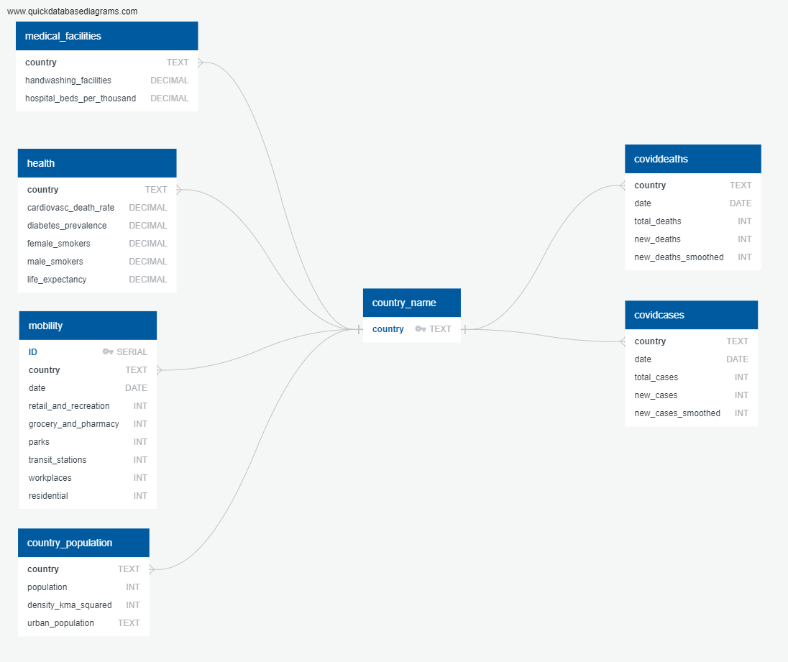

# ETL-project
Monash Data Bootcamp ETL Project

Patrick, Milena, France 

The purpose of this project was to extract, transform and load the data from a few different sources into one database. 

The goal of the dataset which was put together was to allow an in-depth covid pandemic's analysis for each country based on its population size, health, medical facilities and movements. 

Overall database idea:

# Extract

There were three key sources of data used:

Country Population Data – dataset from Kaggle -  https://www.kaggle.com/eng0mohamed0nabil/population-by-country-2020

Country Covid Data – dataset from GitHub - https://github.com/owid/covid-19-data/tree/master/public/data

COVID-19 Community Mobility Data - dataset from Google - https://www.google.com/covid19/mobility/
The data source is a csv file related to the movement within communities as affected by the COVID-19 pandemic. This report from Google tracked movement trends by country over time, across multiple places such as: retail & recreation, groceries & pharmacies, parks, transit stations, workplaces, and residential.

# Transform

Country Population Data:
 -
 The country population dataset is a csv file from kaggle. In order to extract, transform and load the data the following steps were taken:
 * read the file into a dataframe from the csv
 * remove irrelevant rows
 * rename columns to match postgres column name
 * set country as index
 * remove duplicates if necessary
 
 
 To extract the data, we downloaded the csv from kaggle, then read it into a pandas dataframe.
 To clean the data, we filtered out the columns that we didn't want, and renamed the relevant column
 headers to match our postgres headers. 
 To transfrom the data, we created our database connection, then used the transformed.to_sql function.

Country Covid Data: 
 - 
Covid Dataset is a csv file, which contains covid related data by country (cases, deaths, vaccinations, hospital admissions, etc.), together with additional information related to countries' populations. In order to retain only the required data following steps have been taken:
 * remove not required rows
 * rename 'location' column
 * create separate DataFrames with data related to: covid cases, covid deaths, health info and medical facilities info 
   NOTE: it's possible to get more data from this dataset, however the above listed have been chosen as an example
 * remove empty and duplicate rows if required
 * set index to 'country'

COVID-19 Community Mobility Data:
- 
From the extracted report, the goal is to get the country-level mobility data only. The following steps were completed.
 * convert date column from object to date.
 * remove rows with dates other than year 2020.
 * retain country-level data only by removing rows with values under col 2-6.
 * delete col 0 & 2-7 (not needed).
 * convert cols percent_change_from_baselin from object dtype to integer.
 * rename columns.
 * set index to country.

# Load 

Cleaned DataFrames have been loaded into PostgreSQL. Structured database has been chosen over unstructured, because the used datasets were already in the table format, which made it easy to integrate into structured database. Additionally, PostgreSQL has the advantage of being able to assign primary keys, which makes it easy to avoid data duplication. 

# Example analysis

Database can be utilized in order to perform various covid related analyzes. 

For example, we can check the impact of the people movement restrictions during lockdowns on a number of new cases. For instance - in Australia we can see what seems to be a relationship between movement's restrictions and a number of new cases during the first wave, however this relationship is not visible during the second wave. 

Another thing we can look into is the relation between country’s population and a number of cases, in this particular example between population density number of cases: 

# Used Tools
 * Jupyter Notebook 
 * Pandas
 * PostgreSQL
